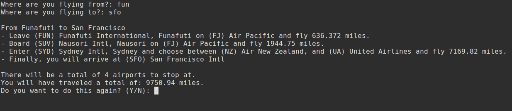

# Shortest Airline Route
Finds shortest path between any two airports in the world, implemented using Dijkstra's algorithm.

Aiport and airline information is provided by the U.S. Bureau of Transportation

# Screenshot

